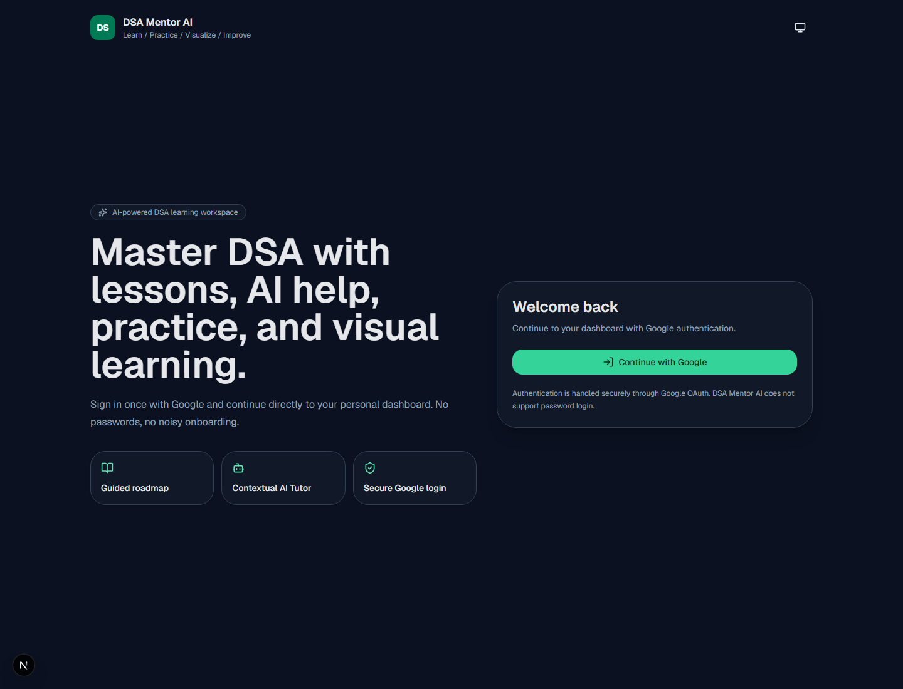
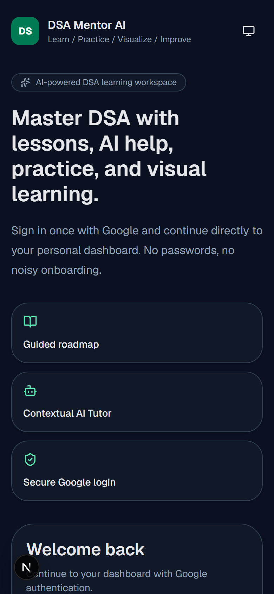
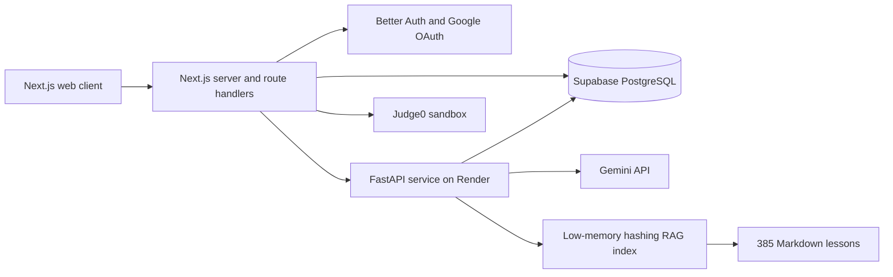

# DSA Mentor AI

[](https://github.com/nemairoy/dsa-mentor-ai/actions/workflows/ci.yml)
[](https://dsamentor-ai.vercel.app)
[](https://dsa-mentor-ai-api-l97r.onrender.com/health)
[](https://nextjs.org/)
[](https://fastapi.tiangolo.com/)
[](LICENSE)

An end-to-end DSA learning platform that combines a structured 385-lesson roadmap, visual explanations, personalized progress, AI tutoring, interview practice, and sandboxed Python/Java/C++ execution.

**Live application:** [dsamentor-ai.vercel.app](https://dsamentor-ai.vercel.app)

**API readiness:** [dsa-mentor-ai-api-l97r.onrender.com/health](https://dsa-mentor-ai-api-l97r.onrender.com/health)

> Google OAuth is required for the private learning workspace. No password credentials are collected by this application.

## Product highlights

- **Structured curriculum:** 37 chapters and 385 lessons with theory, diagrams, guided examples, code, complexity analysis, quizzes, revision, and related practice.
- **Coding Marathon:** an AI problem setter beside a Judge0-backed compiler, with validated test cases, hints, autosaved drafts, and copy-ready solutions.
- **AI tutor:** lesson-aware explanations, follow-up help, code review, complete fenced solutions, and retrieval from the indexed knowledge base.
- **Practice workspace:** Python, Java, and C++ execution with per-test results and AI-assisted validation.
- **Visual learning:** topic-specific concept diagrams and algorithm animations designed for desktop and mobile.
- **Personal workspace:** Google sign-in, profile, notes, bookmarks, progress, achievements, analytics, and idle-session protection.
- **Production hardening:** health/readiness endpoints, pooled PostgreSQL connections, distributed rate limiting, internal API authentication, low-memory RAG indexing, CI, and responsive error/loading states.

## Screenshots

| Desktop sign-in | Mobile sign-in |
| --- | --- |
|  |  |

Authenticated product screens contain personal data, so the public repository only includes the sign-in experience. Use the live application with Google OAuth to review the full workspace.

## Architecture



- `apps/web` — Next.js 16 App Router application, Better Auth, UI, server routes, repositories, and Judge0 proxy.
- `apps/api` — FastAPI AI/RAG service with health checks, internal authentication, and a shared Gemini client.
- `content` — versioned curriculum, lesson metadata, animation maps, and generated search index.
- `db/migrations` — application schema and distributed rate-limit migrations.
- `docs` — architecture, API, database, security, testing, deployment, backup, AI, RAG, and CMS documentation.

See [Architecture](docs/ARCHITECTURE.md) and [API documentation](docs/API_DOCUMENTATION.md) for more detail.

## Technology stack

| Layer | Technology |
| --- | --- |
| Web | Next.js 16, React 19, TypeScript, Tailwind CSS |
| Authentication | Better Auth, Google OAuth |
| API | FastAPI, Pydantic, HTTPX |
| Database | PostgreSQL / Supabase, `pg`, `asyncpg` |
| AI | Gemini `gemini-2.5-flash-lite` with key rotation and bounded retries |
| Retrieval | ChromaDB-compatible collection with deterministic low-memory hashing embeddings |
| Code execution | Judge0 for Python, Java, and C++ |
| Hosting | Vercel (web), Render (API), Supabase (database) |
| Quality | GitHub Actions, ESLint, TypeScript build, Python unit tests, content and production validators |

## Local development

### Prerequisites

- Node.js 22+
- npm 10+
- Python 3.12+
- PostgreSQL/Supabase project
- Google OAuth client
- Gemini API key
- Judge0-compatible endpoint

### 1. Install dependencies

```powershell
npm ci
python -m venv .venv
.\.venv\Scripts\Activate.ps1
pip install -r apps/api/requirements.txt
```

On macOS/Linux, activate Python with `source .venv/bin/activate`.

### 2. Configure environment variables

Copy the reviewed templates and replace every placeholder with your own development credentials:

```powershell
Copy-Item apps/web/.env.example apps/web/.env.local
Copy-Item apps/api/.env.example apps/api/.env
```

Never commit `.env` files, OAuth client-secret downloads, database passwords, or API keys. The optional `npm run env:bootstrap` command is only for the repository owner's legacy local credential file; new contributors should use the templates above.

### 3. Prepare the database

```powershell
Set-Location apps/web
npx auth@latest migrate
Set-Location ../..
```

Then apply the SQL files in `db/migrations` in numeric order to the same PostgreSQL database used by both services.

### 4. Start both services

Terminal 1:

```powershell
npm run dev:api
```

Terminal 2:

```powershell
npm run dev:web
```

- Web: `http://localhost:3000`
- API: `http://127.0.0.1:8000`
- API readiness: `http://127.0.0.1:8000/health`
- API liveness: `http://127.0.0.1:8000/health/live`

## Validation

Run the same checks used by CI:

```powershell
npm run validate:content
npm run validate:production
npm run lint:web
npm run build:web
$env:PYTHONPATH = "apps/api"
python -m unittest discover -s apps/api/tests -v
npm audit --audit-level=high
```

CI runs on every pull request and every push to `main`.

## Deployment

- Vercel builds `apps/web` from `main`.
- Render builds `apps/api` using `render.yaml`.
- Both services share the PostgreSQL database and internal API credential.
- RAG indexing starts automatically and uses a low-memory embedding backend suitable for the deployed API instance.
- Judge0 executes untrusted student code outside the web/API processes.

Follow the [Deployment Guide](docs/DEPLOYMENT_GUIDE.md) for environment variables, migrations, health checks, and rollback verification.

## Security notes

- Secrets are server-only and ignored by Git.
- Protected routes validate Better Auth sessions.
- Web-to-API calls use an internal credential.
- AI, visualization, and other expensive routes are rate-limited through PostgreSQL.
- Code execution is delegated to Judge0 with CPU, wall-time, memory, and request limits.
- Production readiness checks cover security files, content integrity, and build configuration.

See [Security Review](docs/SECURITY_REVIEW.md) for threat boundaries and remaining operational recommendations.

## Documentation

- [Architecture](docs/ARCHITECTURE.md)
- [Deployment](docs/DEPLOYMENT_GUIDE.md)
- [API](docs/API_DOCUMENTATION.md)
- [Database schema](docs/DATABASE_SCHEMA.md)
- [AI pipeline](docs/AI_PIPELINE.md)
- [RAG](docs/RAG_DOCUMENTATION.md)
- [Testing strategy](docs/TESTING_STRATEGY.md)
- [Security review](docs/SECURITY_REVIEW.md)
- [Security policy](.github/SECURITY.md)
- [Backup and recovery](docs/BACKUP_RECOVERY.md)
- [Contributing](docs/CONTRIBUTING.md)

## Repository status

The production web app, API, database readiness, Google OAuth start flow, AI generation, and 385-lesson/3,083-chunk RAG index are actively smoke-tested. Operational limitations and follow-up recommendations are recorded in [Production Readiness](docs/PRODUCTION_READINESS_REPORT.md).

## Ownership and license

Copyright © 2026 **Nemai Roy**. All rights reserved.

Nemai Roy is the sole owner and maintainer of DSA Mentor AI. The repository is publicly visible for portfolio and evaluation purposes, but it is not open-source software. No permission is granted to copy, modify, redistribute, sublicense, sell, or deploy this project without prior written authorization. See [LICENSE](LICENSE).
