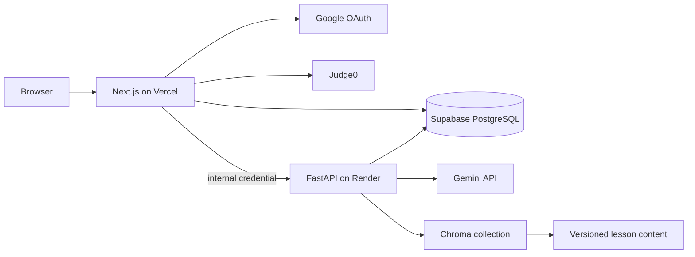

# Architecture

DSA Mentor AI uses clear domain, application, infrastructure, and framework boundaries across a Next.js web service and a FastAPI AI/RAG service.

## Runtime topology

The browser never receives database, Gemini, Google client-secret, or internal API credentials.

## Web application

`apps/web` is a Next.js 16 App Router application.

- `src/app` contains pages, layouts, route handlers, metadata routes, and protected/auth route groups.
- `src/components` contains reusable UI and feature components.
- `src/core` contains domain schemas, application services, and repository contracts.
- `src/infrastructure` contains PostgreSQL, configuration, and logging adapters.
- `src/lib` contains Better Auth, session, prompt safety, internal API, and distributed rate-limit integration.

Better Auth owns browser sessions and Google OAuth callbacks at the web edge. Protected pages resolve the session server-side. Route handlers repeat authorization checks before profile, progress, notes, bookmarks, AI, administration, and execution operations.

The code executor sends bounded jobs to Judge0. Python, Java, and C++ harnesses normalize function-style submissions and test-case values while Judge0 isolates untrusted code from application processes.

## API service

`apps/api` is a FastAPI service responsible for:

- readiness and liveness endpoints;
- internally authenticated AI generation;
- Gemini key rotation, retry budgets, and shared HTTP connections;
- RAG indexing, status, search, and question answering;
- PostgreSQL connectivity required by readiness.

The API is not a public client API. Web-to-API requests include a derived or explicitly configured internal credential and a student identifier.

## Data and retrieval

PostgreSQL stores Better Auth tables and application data including profiles, progress, notes, bookmarks, practice attempts, intelligence data, administration records, and distributed rate-limit counters. Application migrations are versioned in `db/migrations`.

The curriculum is versioned under `content/`: 37 chapters and 385 Markdown lessons plus metadata, search, AI, and animation maps. RAG uses deterministic normalized feature-hashing embeddings, avoiding the PyTorch/SentenceTransformer memory footprint that exceeded the deployed Render instance. Indexing is batched and bootstraps in the background.

## Failure boundaries

- `/health/live` confirms the API process is alive.
- `/health` confirms readiness and returns 503 when PostgreSQL is unavailable.
- The web AI proxy uses bounded timeouts and a same-model server-side fallback.
- Database connections use pooled Supabase endpoints and bounded application pools.
- Distributed PostgreSQL counters keep rate limiting consistent across serverless instances.
- Judge0 jobs enforce CPU, wall-time, memory, and request timeouts.

## Deployment

- Vercel deploys the web service from `main`.
- Render deploys the API using `render.yaml`.
- Supabase provides PostgreSQL.
- GitHub Actions validates both services on pull requests and pushes to `main`.

See [Deployment Guide](DEPLOYMENT_GUIDE.md), [Database Schema](DATABASE_SCHEMA.md), [AI Pipeline](AI_PIPELINE.md), and [RAG Documentation](RAG_DOCUMENTATION.md).
